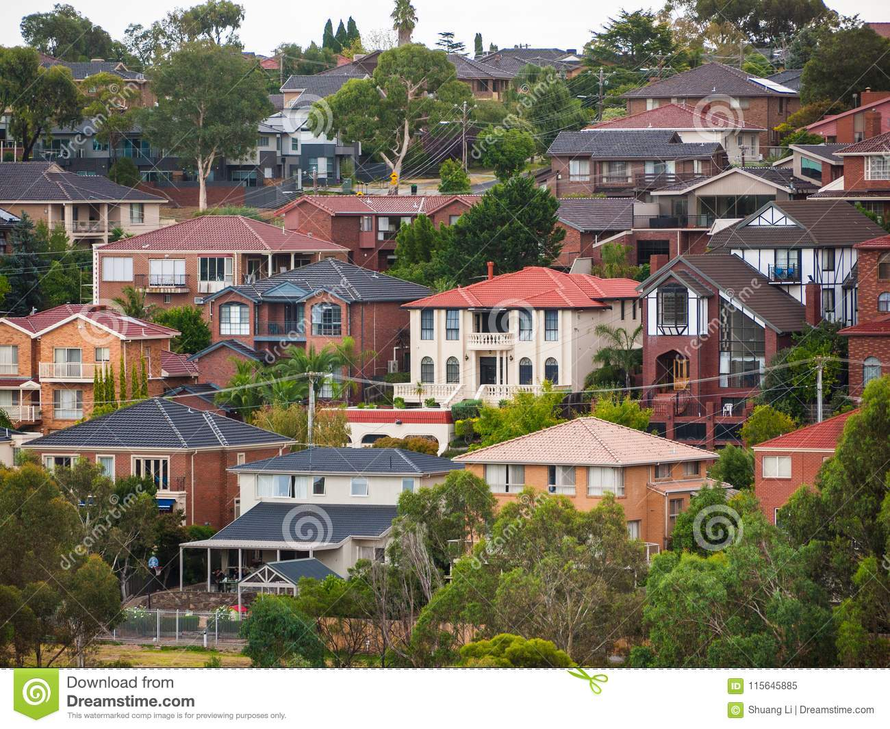

# Housing Price Prediction
[Melbourne Housing Price Prediction](https://github.com/salehakhatun/Final-Project/)

## The scope of this project is to create a website to predict housing prices of Victoria. The website created can be used by any buyer or an investor. We have used linear regression analysis to predict the outcome

## Data Source: API call from Domain.com.au to obtain  property listing data.
LGA locality data from https://discover.data.vic.gov.au/dataset/victorian-electors-by-locality-postcode-and-electorates

- [Melbourne Housing Market](https://www.domain.com.au/)

## Technologies/Tools: 
- Jupyter Notebook
- Python
- Numpy
- Pandas
- Seaborn
- Matplotlib
- Tableau
- PostgreSQL/ SQLAlchemy
- Machine Language
- Scikit-learn
- Flask
- Js/HTML/CSS

## Approach:
01. Identify data source
02. Collect and clean Melbourne housing data
03. Normalized target feature for better model results
04. Create charts and graphs using Matplotlib
05. Load data into PostgreSQL
06. Transform data to be fitted into models
07. Test varying machine learning models and determine best option
08. Customize HTML and CSS for final application
09. Develope Flask application for model deployment
10. Visualize dashboard in Tableau
11. deploy locally

## Team-Dolphin Smart:
01. Hatim M
02. John N
03. Jasjeet K
04. Saleha K
05. Kumudi M
06. Phimnarin
- [Power_Point_Presentation](https://docs.google.com/presentation/d/10QqLe6cVk36krEt7sko1TTdsS9jA7ldJLU9eKnF7EZM/edit#slide=id.g12742dce94f_3_133/)
